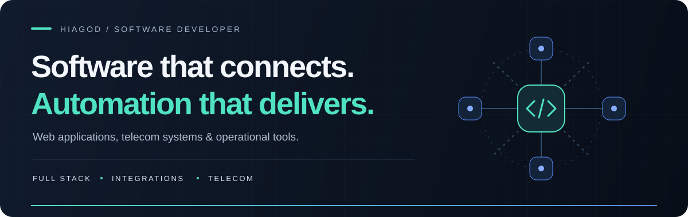

  

  <a href="#selected-work"><strong>Selected work ↗</strong></a> &nbsp; · &nbsp;
  <a href="#technology"><strong>Technology ↓</strong></a> &nbsp; · &nbsp;
  <a href="https://github.com/Hiagod001?tab=repositories"><strong>Explore repositories ↗</strong></a>

## Building tools for real operations.

I'm **Hiagod**, a software developer working at the intersection of **web applications, automation and telecommunications**. I build tools that connect services, simplify repetitive workflows and give teams a clearer view of their operations.

My projects range from Asterisk PBX management and AI-assisted support supervision to service scheduling, sales dashboards and messaging integrations.

| Focus | What I build |
| :--- | :--- |
| **Web applications** | Internal platforms, management interfaces and operational dashboards. |
| **Automation & integrations** | API connections and workflows across business and communication tools. |
| **Telecom software** | PBX interfaces, service-order scheduling and support operations tools. |

## Selected work

<table>
<tr>
<td width="50%" valign="top">

### ☎ &nbsp; PBX Management

Web interface for managing Asterisk extensions, queues, trunks and IVR, with monitoring and an Electron extension app.

**JavaScript · Asterisk · Electron**

[Explore the project ↗](https://github.com/Hiagod001/PBX)

</td>
<td width="50%" valign="top">

### ✦ &nbsp; AI Support Supervision

Support supervision platform with AI-assisted workflows, Blip and PBX integrations, and views for managers and operators.

**TypeScript · React · Tailwind CSS**

[Explore the project ↗](https://github.com/Hiagod001/white-telecom-supervisao-ia)

</td>
</tr>
<tr>
<td width="50%" valign="top">

### ↗ &nbsp; Sales Performance

Web dashboard for sales rankings, goal tracking and visibility into commercial team performance.

**JavaScript · Node.js · Dashboards**

[Explore the project ↗](https://github.com/Hiagod001/Ranking-Vendas)

</td>
<td width="50%" valign="top">

### ◷ &nbsp; Service Scheduling

IXC-integrated service-order scheduling with user management, appointment slots, bookings and reporting.

**JavaScript · IXC Integration · Operations**

[Explore the project ↗](https://github.com/Hiagod001/ixc-agenda)

</td>
</tr>
</table>

## Technology

Tools used across my projects. Select an icon to visit its official website.

  &nbsp;
  &nbsp;
  &nbsp;
  &nbsp;
  &nbsp;
  &nbsp;
  &nbsp;
  &nbsp;
  &nbsp;
  

**JavaScript / TypeScript** &nbsp; · &nbsp; **Node.js / Express** &nbsp; · &nbsp; **React / Next.js**  
**Tailwind CSS** &nbsp; · &nbsp; **Electron** &nbsp; · &nbsp; **Cloudflare** &nbsp; · &nbsp; **Git**

**Integrations:** [Asterisk](https://www.asterisk.org/) · [IXC](https://www.ixcsoft.com.br/) · [WhatsApp](https://www.whatsapp.com/) · [Blip](https://www.blip.ai/) · [Trello](https://trello.com/)

---

  <strong>Practical software. Connected systems. Clearer operations.</strong> 
  <a href="https://github.com/Hiagod001?tab=repositories">Discover more of my work ↗</a>

<!-- Technology icons: https://github.com/tandpfun/skill-icons (MIT). See assets/icons/LICENSE. -->
